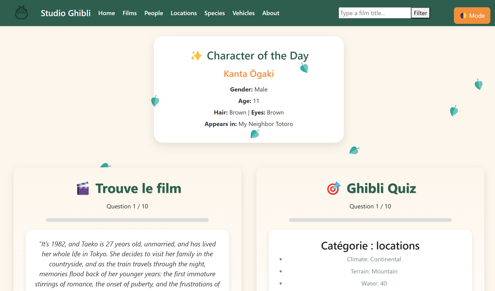

# 🎬 Studio Ghibli Explorer

Une application web interactive qui met en valeur l'univers magique des films de Studio Ghibli à travers une interface moderne et engageante. ([Démo en ligne](https://projet-ghibli-504987642146.europe-west9.run.app/home))




## 🌟 Fonctionnalités

- **Catalogue de films** : Parcourez tous les films de Studio Ghibli avec leurs détails complets.
- **Personnages** : Explorez les personnages emblématiques de l'univers Ghibli.
- **Lieux** : Découvrez les lieux magiques qui apparaissent dans les films.
- **Espèces** : Apprenez-en plus sur les différentes espèces qui peuplent les mondes Ghibli.
- **Véhicules** : Examinez les véhicules étonnants présents dans les films.
- **Mode sombre/clair** : Basculez entre les thèmes visuels selon vos préférences.
- **Jeux interactifs** :
  - **Quiz Ghibli** : Testez vos connaissances sur l'univers Ghibli.
  - **Trouve le film** : Identifiez les films à partir de leurs descriptions.
- **Personnage du jour** : Découvrez chaque jour un nouveau personnage mis en avant.

## 🔧 Technologies utilisées

- **Angular 19** : Framework front-end moderne
- **TypeScript** : Pour un code robuste et typé
- **RxJS** : Gestion des opérations asynchrones
- **API Studio Ghibli** : Source des données ([ghibliapi.vercel.app](https://ghibliapi.vercel.app))
- **Bootstrap** : Pour une interface responsive
- **Docker** : Pour la conteneurisation de l'application

## 🚀 Installation

### Prérequis
- Node.js 18+ et npm
- Angular CLI 19+

### Étapes d'installation

1. Cloner le dépôt :
```bash
git clone https://github.com/votre-utilisateur/ProjetGhibli.git
cd ProjetGhibli
```

2. Installer les dépendances :
```bash
npm install
```

3. Lancer l'application en mode développement :
```bash
npm start
```
L'application sera accessible à l'adresse [http://localhost:4200](http://localhost:4200).

### Utilisation avec Docker

1. Construire l'image Docker :
```bash
docker build -t projet-ghibli .
```

2. Exécuter le conteneur :
```bash
docker run -p 4200:80 projet-ghibli
```

## 📋 Structure du projet

```
ProjetGhibli/
├── src/
│   ├── app/
│   │   ├── films/           # Composants liés aux films
│   │   ├── people/          # Composants liés aux personnages
│   │   ├── locations/       # Composants liés aux lieux
│   │   ├── species/         # Composants liés aux espèces
│   │   ├── vehicles/        # Composants liés aux véhicules
│   │   ├── quizz/           # Quiz interactif
│   │   ├── findthefilm/     # Jeu "Trouve le film"
│   │   ├── header/          # En-tête de l'application
│   │   ├── footer/          # Pied de page
│   │   └── ...
│   ├── assets/              # Images et ressources statiques
│   └── styles.css           # Styles globaux
├── public/                  # Fichiers publics (icônes, images)
└── ...
```

## 🤝 Contributeurs

- **Capucine Debailleul** - [GitHub](https://github.com/SmallCapu2022)
- **Loic Missigbeto** - [GitHub](https://github.com/loic-msgb)

## 📝 Licence

Ce projet est sous licence MIT. Voir le fichier `LICENSE` pour plus de détails.

## 🙏 Remerciements

- [Studio Ghibli API](https://ghibliapi.vercel.app) pour la mise à disposition des données.
- [Studio Ghibli](https://www.ghibli.jp) pour la création d'un univers cinématographique merveilleux qui continue d'inspirer.
